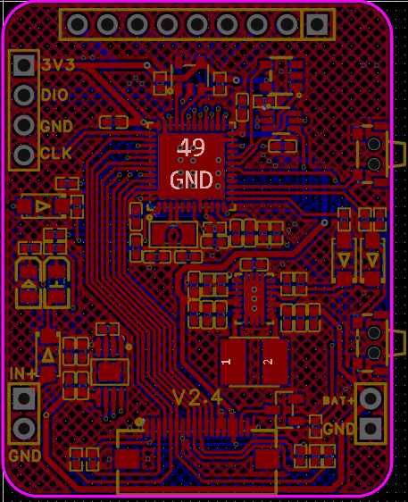

# SmartWatch

## 简介

&emsp;&emsp;**SmartWatch** 是一款基于 **STM32F411CEU6** 微控制器、**FreeRTOS** 实时操作系统以及 **LVGL** 图形界面库开发的多功能智慧手表项目。该项目集成了多种传感器模块与低功耗设计，适合嵌入式系统学习者进行功能扩展和研究开发。功能包括：日历、计算器、抬腕亮屏、蓝牙无线升级、环境温湿度检测、海拔测量、RTC时钟显示与修改等功能。

## 系统组成

本手表集成以下模块与功能：

- **图形界面显示**：基于 **LVGL** 的 LCD 显示界面，支持触控交互、页面切换、时钟/秒表/计算器等小功能。
- **姿态与方向感应**：使用 **LSM303** 三轴加速度计和磁力计模块，实现抬腕唤醒和电子指南针功能。
- **温湿度感知**：通过 **AHT21** 温湿度传感器进行环境温湿度采集。
- **气压与海拔测量**：集成 **SPL06** 气压传感器，实现大气压力和相对海拔高度估算。
- **低功耗管理**：通过进入 Sleep/Stop 模式实现低功耗运行，配合按键中断唤醒机制实现节能。
- **实时时钟（RTC）**：内建 RTC 实现系统时间维护和定时唤醒。
- **EEPROM 数据存储**：支持 I2C 接口外部 EEPROM 进行用户设置或历史数据的保存。并支持损耗均衡策略，延长设备使用寿命。
- **外置看门狗芯片**：集成独立硬件看门狗芯片，通过周期性喂狗机制保障系统运行稳定性。当系统异常卡死或失控时，看门狗自动复位主控，防止系统长时间停滞，提高设备可靠性和鲁棒性。
- **蓝牙无线升级**：通过低功耗蓝牙芯片的SPP功能，实现IAP无线固件升级。用户可以通过上位机连接手表蓝牙实现远程程序下载与更新。同时具备校验机制确保下载固件的完整性与可靠性。
- **FreeRTOS 任务调度与同步**：各模块功能通过 FreeRTOS 的多任务管理协调运行，提升系统响应效率和稳定性，并通过信号量机制同步传感器数据采集。
  

      
  

## 实物图

  <table>
    <tr>
      <td align="center">
         
        图：核心板正面
      </td>
      <td align="center">
         
        图：核心板背面
      </td>
    </tr>
  </table>
  

## 软件部分设计细节

- **GUI 任务**
  - 基于 LVGL 实现图形用户界面及交互逻辑。为管理多页面切换，系统设计了一个 `Page_stack` 页面栈，用于记录页面切换路径。初始界面 `HomePage` 位于栈底；当新页面被唤起时，当前页面的控制块通过 `Page_Push` 压入栈中，然后调用 `Page_Load` 初始化并加载新页面，同时释放旧页面组件以节省内存资源。页面回退时，通过 `Page_Top` 获取上一个页面的控制块，并执行其绑定的初始化函数，实现页面状态的恢复与切换。最后将栈顶页面通过 `Page_Pop` 弹出栈。

  - 为实现传感器采集任务与用户界面显示的联动效果，系统结合使用了 FreeRTOS 的信号量机制与 LVGL 的定时器功能。当某个界面负责显示特定传感器数据时，会在页面初始化过程中释放相应传感器任务所等待的信号量，从而唤醒该采集任务并更新数据。与此同时，LVGL 定时器定期触发刷新操作，程序会比较当前显示的数据与最新采集结果，若存在差异则自动刷新界面，确保数据显示的实时性与准确性。
  
  - 计算器功能实现的核心在于将用户输入的 `中缀表达式` 转换为计算机能够直接执行的 `后缀表达式`（也称逆波兰表达式）。为支持包括小数在内的四则运算，系统设计了多个结构体，分别用于表示中缀表达式中的 数字、运算符 及其组合形式，并通过模拟 栈（stack）结构 实现表达式的转换与求值。

  &emsp;&emsp;具体实现中，中缀转后缀采用经典的栈操作算法，对运算符优先级进行判断与处理；后缀表达式的求值则在转换完成后顺序执行。由于采用结构体进行封装，系统能够自然地支持 小数点精度计算，避免了传统字符串处理方式在数值精度方面的限制。

  &emsp;&emsp;此外，计算器还具备以下功能特性：

  &emsp;&emsp;&emsp;&emsp;`删除功能`：支持逐字符删除输入内容，提升用户交互体验；

  &emsp;&emsp;&emsp;&emsp;`自动格式化结果`：计算结果统一保留 6 位小数，保证数值显示的一致性与可读性；

  &emsp;&emsp;&emsp;&emsp;`错误处理机制`：对非法输入、除零错误等情况进行判断并提示，提升系统健壮性。

  &emsp;&emsp;整体计算流程如下：

  &emsp;&emsp;&emsp;&emsp;1. 解析用户输入的中缀表达式并遍历，当遇到操作数，将其压入操作数栈。

  &emsp;&emsp;&emsp;&emsp;2. 遇到运算符时，如果运算符栈为空，则直接将其压入运算符栈。

  &emsp;&emsp;&emsp;&emsp;3. 如果运算符栈不为空，那就与运算符栈顶元素进行比较：如果当前运算符优先级比栈顶运算符高，则继续将其压入运算符栈，如果当前运算符优先级比栈顶运算符低或者相等，则从操作数栈顶取两个数，从运算符栈顶取出运算符进行运算，并将结果压入操作数栈。

  &emsp;&emsp;&emsp;&emsp;4. 继续将当前运算符与运算符栈顶元素比较。

  &emsp;&emsp;&emsp;&emsp;5. 继续按照以上步骤进行遍历，直到操作数栈只剩一个元素。

- **传感器采集任务**
  &emsp;&emsp;在这里我将所有的传感器都单独创建一个任务执行。除了lvgl_handler任务优先级较高之外（因为需要保证屏幕刷新正常），其他任务优先级均相同，执行时间片轮转策略或是主动放弃CPU的协作式调度，所有任务交由FreeRTOS的调度器统一管理。
  - **LSM303(加速度计与磁力计)**：配置中断实现抬腕检测，定期采集加速度与磁场。

  - **AHT21(温湿度传感器)**：周期性采集环境数据，显示在主界面。采样频率由LVGL的定时器频率决定，如果LVGL定时器2s刷新一次，那么采样频率就是0.5Hz。AHT21的采集数据过程如下：

  &emsp;&emsp;&emsp;&emsp;1. 上电后等待40ms，读取温湿度值之前，首先要看状态字的校准使能位Bit[3]是否为1(通过发送0x71可以获取一个字节的状态字)，如果不为1，要发送0xBE命令(初始化)，此命令参数有两个字节，第一个字节为0x08，第二个字节为0x00，然后等待10ms。

  &emsp;&emsp;&emsp;&emsp;2. 直接发送0xAC命令(触发测量)，此命令参数有两个字节，第一个字节为0x33，第二个字节为0x00。

  &emsp;&emsp;&emsp;&emsp;3. 等待80ms待测量完成，如果读取状态字Bit[7]为0，表示测量完成，然后可以连续读取六个字节；否则继续等待。

  &emsp;&emsp;&emsp;&emsp;4. 当接收完六个字节后，紧接着下一个字节是CRC校验数据，用户可以根据需要读出，如果接收端需要CRC校验，则在接收完第六个字节后发ACK应答，否则发NACK结束，CRC初始值为0xFF，CRC8校验多项式为：
    

      
    

  &emsp;&emsp;&emsp;&emsp;5. 计算温湿度值。
    

        
    

  - **SPL06(气压传感器)**：周期性采集气压数据，并估算海拔高度。

  - **LVGL(图形界面库)**：周期性执行lv_timer_handler函数，刷新LCD屏幕。

  - **WatchDOG(外置看门狗芯片)**：周期性喂狗。

- **🔋 低功耗处理任务**
  - 系统会根据用户交互超时或外设状态判断是否进入低功耗模式，以延长设备续航时间。主要涉及两种模式：
  
  - **Sleep模式**：在常规息屏或长时间无交互事件发生时，系统会进入Sleep模式；进入Sleep模式前，软件会同步降低MCU的系统时钟频率，并适当调整外设时钟（如ADC、RTC、I2C等），以保证基本功能不受影响。
  
  &emsp;&emsp;Sleep模式下MCU暂停部分模块运行，但仍可保留中断响应机制，如支持“抬腕亮屏”检测、中断唤醒等低功耗外设功能。是在低功耗与实时响应之间的平衡选择。

  - **Stop模式**：当用户主动触发深度节能操作时，系统可进入Stop模式；Stop模式下MCU核心与大部分时钟源将完全停止，仅保留寄存器状态和部分低功耗外设（如RTC）运行；在Stop模式下功耗极低，但需要通过外部中断或RTC唤醒，唤醒后需要重新初始化系统时钟和必要的外设。

- **EEPROM 数据管理与损耗均衡策略**

  &emsp;&emsp;为了提升设备的智能性与用户体验，系统设计中集成了EEPROM数据存储机制，用于在掉电后仍能可靠保存关键配置与历史传感数据。
  - **数据保存内容**：系统通过I2C接口与外部EEPROM通信，周期性且在关机前保存如下信息：

  &emsp;&emsp;1. 上一次关机前的环境传感器数据：包括温湿度（AHT21）、海拔高度（SPL06）、磁场强度（LSM303）；

  &emsp;&emsp;2. 用户自定义设置项：例如LCD背光亮度级别、蓝牙开启状态；

  &emsp;&emsp;3. 实时时钟设置：包括用户调整后的RTC时间，方便在重新上电后进行时间同步；

  - **损耗均衡策略**：由于EEPROM的擦写次数有限，为延长其使用寿命，本系统采用`环形地址偏移策略`实现简单有效的损耗均衡。

  &emsp;&emsp;1. 每类数据分配一段连续地址空间作为循环缓冲区；

  &emsp;&emsp;2. 每次写入时在上次地址基础上向后偏移固定步长（比如16字节），绕回起始地址形成闭环；

  &emsp;&emsp;3. 读取时通过固定的标志位判断偏移量定位最近一次有效数据；

  &emsp;&emsp;4. 避免反复擦写同一区域，有效分散写入负载。

## 硬件设计说明
  &emsp;&emsp;硬件设计来自：https://oshwhub.com/no_chicken/zhi-neng-shou-biao-OV-Watch_V2.2 电路部分完全采用该版本设计。本人在打样 PCB 并完成焊接调试后，基于该平台完成功能实现与二次开发。核心板与背板的电路原理图如下：
  

  <table>
    <tr>
      <td align="center">
         
        图：核心板正面
      </td>
      <td align="center">
         
        图：核心板背面
      </td>
    </tr>
  </table>
  

---

